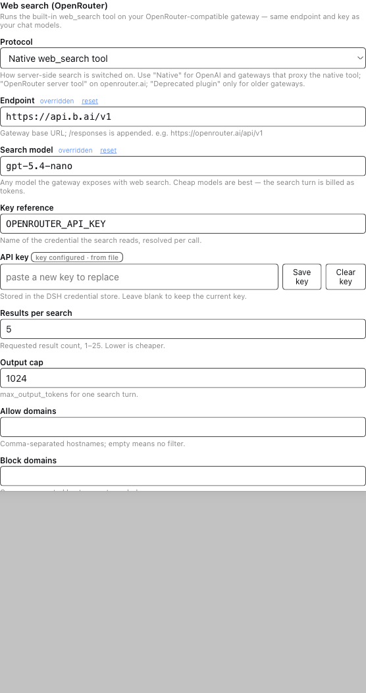

# dsh-web-search-openrouter

**Grounded web search for DeepSeek Harness, on the gateway you already pay for.**

[](https://github.com/vitas/dsh-web-search-openrouter/actions/workflows/ci.yml)
[](https://www.npmjs.com/package/@samebits/dsh-web-search-openrouter)
[](./LICENSE)
[](./package.json)

`@samebits/dsh-web-search-openrouter` registers a search provider on the harness's
web seam (`ctx.web`). The built-in `web_search` tool then runs **server-side** on
an OpenRouter-compatible gateway — the same endpoint and the same API key as your
chat models. Nothing about the model-facing tool surface changes: same tool, same
arguments, same citeable results. Only the engine behind it moves off the
harness's bundled DeepSeek search and onto your own gateway budget.

- **Three protocols, one provider.** Native OpenAI `web_search`, OpenRouter's
  `openrouter:web_search` server tool, and the deprecated `plugins: [{ id: 'web' }]`
  field. Pick the one your gateway accepts.
- **Reads every citation shape.** `web_search_call.action.sources[]`,
  `openrouter:web_search.action.sources[]`, and `url_citation` annotations —
  including snippets sliced out of the cited span when the gateway sends no
  excerpt.
- **Editable at runtime.** A card on the Plugins settings tab (English, 中文,
  Русский) with a **Test search** button that runs one real query through the
  saved configuration.
- **No servers, no telemetry.** The only outbound request is the search itself,
  to the endpoint you configured. Nothing is sent anywhere else.
- **Dependency-free host.** No `@deepseek-ai/*` runtime imports, so it works in a
  linked development checkout as well as from the registry.



---

## Install

From GitHub — the package ships a bundle patch (`dsh.bundle.patch`), so adding it
composes everything: it points the web seam at this provider and inserts the
provider row.

```sh
dsh plugin add github:vitas/dsh-web-search-openrouter --profile web
```

From npm, once released under this name:

```sh
dsh plugin add @samebits/dsh-web-search-openrouter --profile web
```

<details>
<summary>Installing from a local checkout</summary>

```sh
git clone https://github.com/vitas/dsh-web-search-openrouter.git
cd dsh-web-search-openrouter && npm install && npm run build
dsh plugin add link:$PWD --profile web
```
</details>

Then store the key and restart once:

```sh
dsh credential set OPENROUTER_API_KEY   # or export it before launching dsh
```

The credential reference is resolved **per search**, through the DSH credentials
service (Settings → Models) and then the process environment — so rotating a key
never needs a restart. The bundle patch is applied at boot; a linked checkout's
host entry is imported at boot too, so the first run after installing needs one
`dsh web` restart. After that, every settings edit from the card is live.

## Quick start

1. Install the package (above).
2. Restart `dsh web`, then open **Settings → Plugins → Web search (OpenRouter)**.
3. Set **Endpoint**, **Search model**, and paste your **API key**.
4. Press **Test search** — you should get a source count and the first hits.
5. Ask the agent something time-sensitive; it will call `web_search` as usual.

## Verified gateways

Web search is a *server tool*: the gateway must implement it for the model you
name. The plugin reports that honestly — if the gateway answers without
searching, the search fails with an explanatory error instead of silently
returning the model's memory.

### `api.b.ai` (protocol `openai`)

Verified working on `/v1/responses` with `tools: [{ type: 'web_search' }]`, hits
returned as `url_citation` annotations. Cheapest first:

| Model | Citations | Notes |
|---|---|---|
| `gpt-5.4-nano` | 2 | cheapest verified; ~8.5k input tokens per query |
| `gpt-5.4-mini` | 4 | |
| `gpt-5.5-instant` | 8 | |
| `gpt-5-mini` | 4 | large input token count |
| `gpt-6-astra`, `gpt-6-sol`, `gpt-5.6-sol`, `gpt-5.5` | 1–4 | |

Not supported on this gateway: `gpt-5-nano`, `glm-*`, `deepseek-*`, the
Anthropic and Gemini routes, `:online` suffixes, `plugins: [{ id: 'web' }]`, and
`openrouter:web_search`.

### `openrouter.ai` (protocol `openrouter`)

Use the server tool:

```yaml
protocol: openrouter
baseURL: https://openrouter.ai/api/v1
model: openai/gpt-5.2   # any model with the web-search badge
```

`engine` (`auto`, `native`, `exa`, `firecrawl`, `parallel`),
`searchContextSize` (`low`, `medium`, `high`), `maxUses`, `maxTotalResults`, and
the domain filters are passed through as server-tool `parameters`. On a
non-OpenRouter gateway this protocol is rejected — that is the gateway talking,
not the plugin.

### OpenAI proper (protocol `openai`)

`https://api.openai.com/v1` + `tools: [{ type: 'web_search' }]`; sources arrive as
`web_search_call.action.sources[]` and are parsed by the same code path.

## Protocols

| `protocol` | Wire shape | Use for |
|---|---|---|
| `openai` *(default)* | `tools: [{ type: 'web_search' }]` | OpenAI, Azure, and aggregators that proxy the native tool (`api.b.ai`) |
| `openrouter` | `tools: [{ type: 'openrouter:web_search', parameters }]` | `openrouter.ai` and gateways that adopted the server tool |
| `plugin` *(deprecated)* | `plugins: [{ id: 'web', … }]` | older gateways that never adopted the server tool |

## Settings reference

Every field is editable from the settings card and can be seeded from the
composition entry; a field set in `settings.yaml` is marked *overridden* in the
card and can be reset there.

| Field | Default | Meaning |
|---|---|---|
| `protocol` | `openai` | Enablement surface (see above) |
| `baseURL` | `https://openrouter.ai/api/v1` | Gateway base; `/responses` is appended |
| `model` | `openai/gpt-5.2` | Model that exposes web search on that gateway |
| `apiKeyEnv` | `OPENROUTER_API_KEY` | Credential reference, resolved per search |
| `apiKey` | — | Literal key; wins over `apiKeyEnv` (keep it out of shared profiles) |
| `maxResults` | `5` | Requested results, 1–25; lower is cheaper |
| `maxOutputTokens` | `1024` | `max_output_tokens` for one search turn |
| `includeAnswer` | `false` | Return the search model's prose as `content` too |
| `engine` | — | `openrouter` protocol only |
| `searchContextSize` | — | `openrouter` protocol only: `low`/`medium`/`high` |
| `maxUses` | — | `openrouter` protocol only: cap server-tool invocations |
| `maxTotalResults` | — | `openrouter` protocol only |
| `allowedDomains` | — | Restrict results to these hostnames |
| `excludedDomains` | — | Drop results from these hostnames |
| `referer`, `title` | — | `HTTP-Referer` / `X-Title` attribution headers |

### Cost

`web_search` is billed as tokens on the search model — not per query. A single
tool call can fan out: `dsh-tool-web`'s `searchMaxQueries` (default 4) turns one
`web_search` into up to four gateway searches, each with its own input context.
Keep `maxResults` low, choose the cheapest model your gateway serves with search,
and raise `searchMaxQueries` only when you actually need breadth. See
[docs/gateways.md](./docs/gateways.md#cost) for measured numbers.

## Troubleshooting

| Symptom | Cause |
|---|---|
| `WEB_PROVIDER_CREDENTIAL_MISSING` | No key stored under `apiKeyEnv`; set it in the card or export it before launching `dsh`. |
| *"the gateway ran no server-side search for model …"* | The model does not expose web search on that gateway. Pick one from the verified table. |
| *"Invalid value: 'openrouter:web_search'"* | The gateway does not implement OpenRouter's server tool; switch `protocol` to `openai`. |
| *"node only allows access to inference API paths"* | A gateway-side proxy restriction; check `baseURL` (a stray trailing slash used to produce `//responses`). |
| `HTTP 404` on `/responses` | The gateway is chat-completions-only; this provider needs a Responses endpoint. |

## Development

```sh
npm install          # installs esbuild + typescript, builds lib/client.js
npm run check        # syntax check the host + typecheck the client
npm test             # 34 offline tests, no network, no credentials
npm run check-locales
npm run build        # rebuild lib/client.js
```

A live smoke test is opt-in and never runs in CI:

```sh
DSH_WEB_SEARCH_LIVE=1 \
OPENROUTER_API_KEY=sk-... \
DSH_WEB_SEARCH_BASE_URL=https://api.b.ai/v1 \
DSH_WEB_SEARCH_MODEL=gpt-5.4-nano \
node --test test/live.test.mjs
```

Architecture, the seam contracts, and the release process live in
[docs/](./docs).

## Privacy

The plugin stores no data and runs no background work. Per search it sends one
HTTPS request to `baseURL` containing your query, the model name, and the
configured parameters; the gateway's own terms govern what happens to it. The
API key is read from the DSH credential store at call time and is never written
to settings, logs, or the browser.

## License

[Apache-2.0](./LICENSE).
